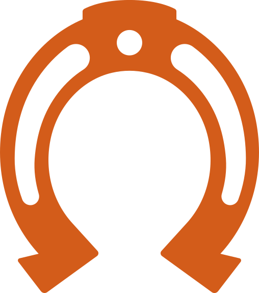
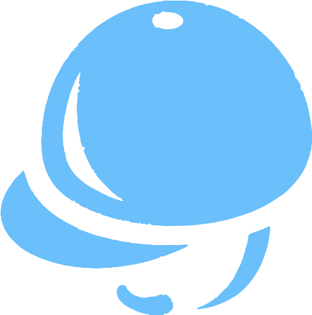

# Hackeando o Inglês: Programando com a Língua que Você Pensa

Ingressar num mercado de tecnologia cujo idioma utilizado nas linguagens de programação é o inglês costuma ser bastante desafiador para quem já não tem conhecimentos da língua. É um cenário que força pessoas iniciantes a aprenderem duas habilidades concomitantemente: a lógica de programação e um novo idioma. E, vamos combinar, elas não são tão triviais de se aprender...&#x20;

A barreira idiomática é uma das causas de desistência de muitas pessoas iniciantes na programação. Imagino que você mesmo tenha tido contato com alguém que comentou sobre a dificuldade com o inglês enquanto tentava aprender a programar, não?&#x20;

Buscando ultrapassar essa barreira, a Cumbuca Dev e a Design Líquido se uniram para oferecer ferramentas e conteúdo de capacitação técnica que são acessíveis a falantes da língua portuguesa e podem ser usadas para fins educacionais ou comerciais e, além disso, são Open Source.&#x20;

<figure><figcaption></figcaption></figure>

Para facilitar a entrada de pessoas iniciantes da área de programação a Design Líquido vem desenvolvendo um ecossistema todo em português! Ou seja, com eles, nós vamos encontrar uma série de ferramentas em língua portuguesa: linguagem de programação, de marcação, de consulta, de estilo, extensão para VS Code e um framework para desenvolvimento web.&#x20;

Com toda essa indumentária, é possível, até mesmo, desenvolver projetos em âmbito comercial! Permitindo mais acessibilidade e autonomia à comunidade lusófona, uma vez que torna o conhecimento da língua inglesa dispensável para aprendizado e geração de emprego.&#x20;

### Mas quais são a vantagens de se programar em português, afinal?&#x20;

* **Acessibilidade e Compreensão:** Programar em sua língua materna, como o português, torna os conceitos de programação mais acessíveis e fáceis de entender, especialmente para iniciantes, reduzindo a barreira de entrada para novas pessoas programadoras;
* **Facilita o Aprendizado:** A programação em português permite que os aprendizes concentrem-se nos conceitos de programação em vez de lidar com a barreira de um segundo idioma. Isso pode acelerar o processo de aprendizado, especialmente para pessoas que não têm fluência em inglês (ou 95% da população que possui o português como língua materna);
* **Melhor Comunicação e Documentação:** Programar em seu idioma nativo leva a uma comunicação mais clara e eficaz com colegas e clientes locais. Além disso, a documentação em português é mais fácil de compreender e seguir;
* **Contribuição para a Identidade Cultural:** Linguagens de programação em português contribuem para a preservação e fortalecimento da identidade cultural e linguística, promovendo o uso e a adoção do idioma em contextos tecnológicos;
* **Facilita a Localização de Erros:** Programar em português pode tornar mais fácil a localização e correção de erros de código, uma vez que os desenvolvedores podem compreender rapidamente o contexto dos problemas.

***

## Agora, vamos conhecer um poucos mais do ecossistema?

#### **OBS: pensei em organizar as imagens ao lado de seus respectivos textos. No caso, achei que ficaria bonito intercalar as imagens alinhas à esquerda e à direita tb**

***

<figure><figcaption></figcaption></figure>

<h2 align="center"><strong>Delégua</strong></h2>

Uma linguagem com sintaxe totalmente em português, pensada para tornar a programação mais próxima, inclusiva e acessível para quem fala a nossa língua.

E vai muito além do educacional: com Delégua e o ecossistema da Design Líquido, você pode construir projetos reais e profissionais 100% em português!

Seu núcleo está [disponível no GitHub](https://github.com/DesignLiquido/delegua), onde você pode encontrar sua documentação completa e como utilizá-la.

***

<figure><figcaption></figcaption></figure>

<h2 align="center">LMHT</h2>

Inspirada no HTML, LMHT propõe uma estrutura de marcação totalmente em português, facilitando a compreensão e utilização por falantes da nossa língua.

Mais do que uma ponte para quem está começando, a LMHT é uma ferramenta prática para a criação de páginas e sistemas reais, sem barreiras idiomáticas.

Também possui documentação e [repositório disponível no GitHub ](https://github.com/DesignLiquido/LMHT)da Design Líquido.

***

<figure><figcaption></figcaption></figure>

<h2 align="center">FolEs</h2>

FolEs é a linguagem de folhas de estilo do ecossistema Design Líquido,  análoga ao CSS, com sintaxe em português.

Pronta para uso profissional, também torna o aprendizado de estilização muito mais acessível e você pode no [repositório do GitHub](https://github.com/DesignLiquido/FolEs).

***

<figure><figcaption></figcaption></figure>

<h2 align="center">LinConEs</h2>

Linguagem de consulta de banco de dados inspirada no SQL, com comandos e estruturas em português, tornando o trabalho mais acessível para quem fala a nossa língua.

Amplia a oportunidades na área de dados, democratizando o acesso a uma das habilidades mais valorizadas no mercado de tecnologia.

Assim como os outros projetos, também está [disponível no GitHub](https://github.com/DesignLiquido/LinConEs) da Design Líquido.&#x20;

***

<figure><figcaption></figcaption></figure>

<h2 align="center">VS Code</h2>

Extensão oficial do Visual Studio Code que contém as linguagens do Design Líquido, incluindo os dialetos que existem oriundos de Delégua.

Suporte completo para as linguagens do ecossistema, com funcionaldiades que tornam o desenvolvimento mais fluído e eficiente.

E você pode acessar o [repositório do projeto ](https://github.com/DesignLiquido/vscode)no GitHub.&#x20;

***

<figure><figcaption></figcaption></figure>

<h2 align="center">Líquido</h2>

E, finalmente, o framework que conecta todas as tecnologias da Design Líquido! Com ele, é possível desenvolver aplicações web com um código 100% em português!

Reúne linguagens, ferramentas e documentação pensadas para tornar o desenvolvimento acessível em português, desde o aprendizado até a produção de soluções profissionais.

E, adivinha? Sim, mais um projeto totalmente [disponível no GitHub](https://github.com/DesignLiquido/liquido) da Design Líquido e apto a receber contribuições.&#x20;

***

Lembrando que esse ecossistema é de código aberto! E você também pode participar do desenvolvimento!&#x20;

Contribuir com projetos Open Source pode ser uma ótima porta de entrada para uma pessoa iniciante construir experiência, aprender junto à comunidade de código aberto e aumentar network. E, para além da experiência, participar do desenvolvimento de projetos assim tem um gostinho especial de estar construindo algo real e útil que pessoas que nem imaginamos podem se beneficiar!

A Design Líquido e a Cumbuca Dev acreditam e praticam o código aberto como filosofia de trabalho. Todo esse ecossistema é feito **pela comunidade e para a comunidade**!

Por isso, queremo te convidar a explorar, usar, construir e contribuir com estes projetos! Eles existem para beneficiar nós, falantes da língua portuguesa, tornando mais acessível o ensino e a prática da programácão.

Só assim vamos conseguir construir, juntos, ferramentas que correspondam à nossa realidade e demandas!

**E, só para dar aquela reforçadinha**: você pode encontrar todos estes projetos no [GitHub da Design Líquido](https://github.com/DesignLiquido) com toda a documentação de como utilizar e como contribuir, além do [canal no YouTube](https://www.youtube.com/@designliquido) que contém uma série de vídeos demonstrativos explicando a estrutura desses projetos.

***

Se você gostou dos repositórios e também acredita que o inglês pode ser uma barreira: dê uma estrela nos repositórios do GitHub - assim mais pessoas podem ter acesso a esse material e, quem sabe, encontrar uma porta de entrada na TI.

**OBS.: acho que essa estrelha tbm ficaria bacana à esquerda com o texto a sua direita**

<figure><figcaption></figcaption></figure>

