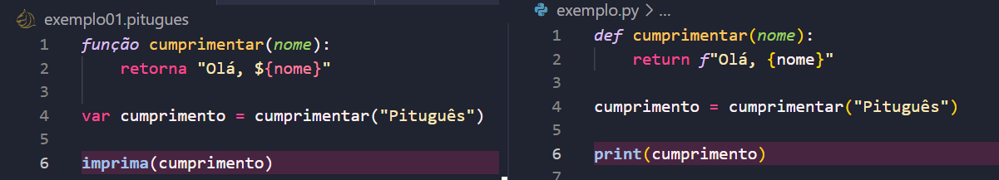
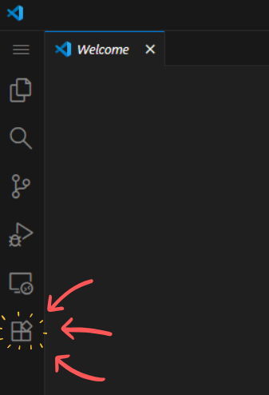
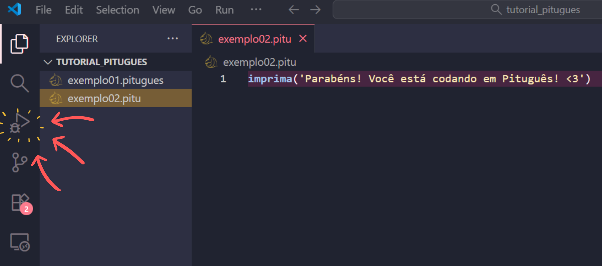
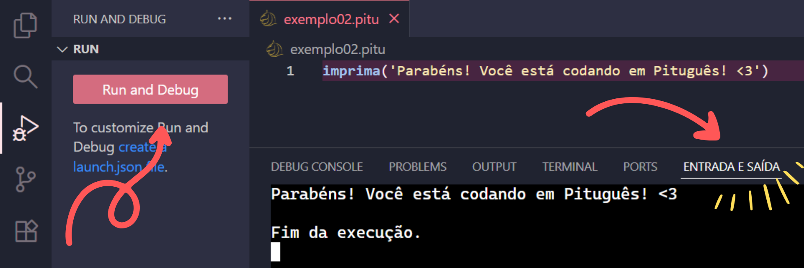
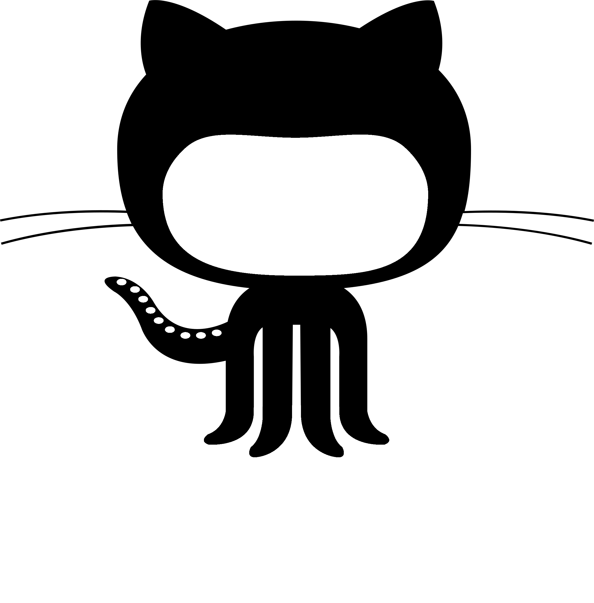

# Tutorial de Pituguês - Vem com a gente programar em Português!

Quando começamos a aprender a programar, uma das primeiras descobertas que nos deparamos é que: as linguagens de programação são todas em inglês! Bom, pelo menos as que são utilizadas no mercado de trabalho.

Estatisticamente falando, apenas 5% dos brasileiros entendem inglês em algum nível, enquanto apenas 1% possui fluência. Ou seja, nem todos os falantes de língua portuguesa tem conhecimento do idioma inglês.&#x20;

O que faz com que a pessoa aprendiz passa encontrar barreiras que a faça dispor mais esforço para desenvolver várias habilidades ao mesmo tempo (programar e aprender outro idioma concomitantemente). Ela terá dificuldades de lidar com recursos e instruções da linguagem de programação, o que poderá comprometer sua aprendizagem de lógica e algoritmos.&#x20;

Aí tem-se a importância de existir uma linguagem como o Pituguês, em que a pessoa nativa em português consiga programar em sua língua mãe, eliminando a barreira idiomática.&#x20;

### Mas de onde vem o Pituguês?

Sua sintaxe é inspirada na da linguagem de programação Python que, embora seu nome faça alusão a uma espécie de cobra e seu símbolo seja composto de duas cobras em Ying & Yang, seus criadores eram muito fãs da série de comédia "Monty Python's Flying Circus" e batizaram a linguagem com o nome de "Python".

Pegando carona até mesmo no nome, se formos traduzir "python", temos "píton". Assim, para trazer a ideia de uma linguagem de programação inspirada em Python para a língua portuguesa, uniu-se "píton" + "português" que resultou em: Pituguês!

E, como comentamos, o Pituguês vai se inspirar e bucar trazer característica do Python para português, como...

#### Tipagem Dinâmica

Quando lidamos com linguagem de programação, devemos lembrar que existem tipos diferentes de dados, como dados textuais, numéricos, binários e etc.&#x20;

Algumas linguagens exigem que o tipo de dado seja declarado como, por exemplo, em Java, declaramos uma variável da seguinte maneira...

```
int numero = 2025;
String nome = "Pituguês";
```

Note que, em Java, indicamos o tipo do dado (int, para números inteiro, e String para tipos textuais), escrevemos o nome da variável e, por fim, damos um valor a ela. Se formos comparar com Python, já possui uma diferença acentuada...

```
numero = 2025
nome = "Pitugues"
```

Como podem ver, já não é necessário indicar o tipo da variável, pois a linguagem irá verificar isso automaticamente, é o que chamamos de "inferir tipo".

No Pituguês, não vai ser diferente, a nossa declaração de variáveis também vai inferir o tipo, mas com alguma pequena diferença na sintaxe...

```
var numero = 3
var nome = "Pitugues"
```

#### Indentação

A indentação nada mais é que o aninhamento de trechos de código que, no caso do Python, se dá através de espaçamento (ou tabulação), ela tem o objetivo de determinar quais linhas de código pertencem a um bloco lógico, definindo a estrutura e hierarquia, como  no exemplo a seguir:

<figure><figcaption></figcaption></figure>

Ou seja, declaramos a nossa função e, em seguida, escrevemos os dois pontos e, logo abaixo deles, com certo espaçamento, começamos a escrever o que a nossa função irá executar. Dessa forma que definimos o escopo e a hierarquia do código, determinando em que momento o trecho de código é iniciado e finalizado.&#x20;

Caso a indentação não seja feita da maneira correta, o próprio Python irá nos sinalizar com uma mensagem mais ou menos assim:

<figure><figcaption></figcaption></figure>

Repare que a função "print\` é chamada após a declaração de uma função, mas não possui um espaçamento que indique que ela pertence àquela função que n'so declaramos. O própria linguagem Python vai nos sinalizar este erro de escrita ao sublinhar a palavra "print" e quando direcionamos o cursor do mouse nela, nos é mostrado uma caixa de diálogo que nos avisa a ausência da indentação, nos impedindo de executar o código.

Assim como Python, o Pituguês também herdou esta característica que deve ter sua sintaxe respeitada para que o programa seja executado:

<figure><figcaption></figcaption></figure>

Note que a função é declarada, o trecho a ser executado está aninhando logo abaixo dela e indentado, mas para efetivamente executar a função, eu devo chamá-la após a sua declaração e sem indentação.&#x20;

#### Orientação a Objetos

A linguagem Python também contempla a Programação Orientada a Objetos (POO), que é um paradigma que nos permite uma forma de organização do programa em que podemos isolar trechos de código independentes, assim podemos proteger esse código e reutilizá-lo, além de torná-lo de fácil manutenção, uma vez que a escrita de uma parte do programa não impactará diretamente em outra.&#x20;

Isso que a POO possibilita tem sua definição através dos pilares de abstração, encapsulamento, herança e polimorfismo que não vamos nos estender sobre estes conceitos, mas, caso não te sejam familiares, recomendamos a leitura [deste artigo](https://www.alura.com.br/artigos/python-poo-engenharia-dados?srsltid=AfmBOorNItC9mCqAPCxCrX-OZmR-Cu1s3vLm35rLUvntnZLvvQ6hXbC3) para deixar seu entendimento mais claro.&#x20;

Embora o Pituguês também tenha herdado a POO do Python, ela ainda se dá de forma um pouco mais simplificada. Até o momento, podemos declarar classes mães e filhas que herdam características umas das outras, possibilitando reaproveitamento de código, como podemos perceber no trecho de código a seguir:

<figure><figcaption></figcaption></figure>

Repare que criamos uma classe "Animal" e depois indicamos ela entre parênteses após declarar a classe "Cachorro". É assim que definimos qual classe irá herdar características de outra, sendo chamadas de "filha" e "mãe", respectivamente - bastante similar a como Python aplica herança em POO.&#x20;

Ao usarmos a função "super" dentro da função "construtor" na classe filha (classe Cachorro), estamos chamando para ser executado o que foi desenvolvido na classe mãe. Além disso, desenvolvemos uma função independente para a classe filha que, ao criarmos o objeto "cachorro" e chamar a função "minha\_especie()", quando o código for executado, irá exibir os dois textos desenvolvidos em cada classe separadamente.

#### Pituguês X Python

Como pudemos ver ao longo do artigo, Pituguês é inspirado em Python. Contudo, para além das traduções de termos, possui algumas diferenças que são perceptíveis no exemplo a seguir, em que, à esquerda, temos um código em Pituguês e, à direita, um código em Python:

<figure><figcaption></figcaption></figure>

Uma das primeiras coisas que podemos notar de diferença é em como começamos a declaração de uma função. Enquanto Python usa o termo "def", que vem de "define", uma abreviatura de "defina", para "definir uma função", Pituguês já opta por uma palavra reservada mais direta em que a pessoa falante de português consegue identificar mais facilmente e intuitivamente que se trata da declaração de uma função.

Também podemos notar a diferença entre as formas de interpolação (a mescla entre um texto um dado). Pituguês possui uma interpolação muito semelhante a de Javascript e Typescript em que temos um texto e o trecho a ser interpolado é indicado entre o sinal de dólar e um par de chaves - ${ }. Enquanto Python sinaliza sua interpolação com o que chamamos de "f-strings", em que indicamos a letra "f" antes do texto e, no meio do texto, usamos um par de chaves - { } - para adicionar o valor a ser mesclado no texto.&#x20;

Além disso, a declaração de variável no Pituguês exige que o termo "var" preceda a declaração do nome da variável, ao passo que isto não funciona na sintaxe de Python.

### Mas como posso usar o Pituguês?

Bom, a instalação dele é bem simples, mas, primeiro, lembre-se que você precisa ter o [Visual Studio Code](https://code.visualstudio.com/) em sua máquina e criar um projeto do zero.

#### Instalação

* Abra seu VS Code, vá até a aba de extensões:

<figure><figcaption></figcaption></figure>

* Busque por "pitugues" ou "design lliquido" para encontrar a extensão "Design Líquido - Linguagens em Português" e clique em "Install":

<figure><figcaption></figcaption></figure>

Pronto! Agora, você já testar a linguagem na sua máquina!

#### Programando com Pituguês

Depois de instalar a extensão e criar um novo projeto, nós vamos:

* Criar arquivos no diretório raiz do projeto, como, por exemplo:

<figure><figcaption></figcaption></figure>

A linguagem permite que você escolha entre dois nomes de extensão de arquivo, pode ser "pitugues" ou "pitu", fica a seu critério :)&#x20;

* Agora, já pode começar a escrever seu código dentro de um dos arquivos, assim:

<figure><figcaption></figcaption></figure>

* Agora, para executar seu código, você vai abrir aba de depuração:

<figure><figcaption></figcaption></figure>

* Selecione o botão "Run and Debug" e, finalmente, na aba do terminal "ENTRADA E SAÍDA" você vai poder ver seu código executando!

<figure><figcaption></figcaption></figure>

#### Pituguês Web

Agora, se você quiser experimentar um pouco do Pituguês sem precisar instalar no seu computador, também temos a versão web dele! Lá você pode brincar e descobrir a linguagem de uma maneira mais rápida.&#x20;

Você pode acessar o Pituguês Web por [aqu](https://designliquido.github.io/pitugues-web/)i!

#### Para saber mais...

Quer se aprofundar no Pituguês e descobrir tudo o que ele oferece?

Você pode acessar a [documentação neste link](https://github.com/DesignLiquido/pitugues-docs/wiki)!  Você poderá conhecer diversos detalhes e exemplos de código que vão bem além do que te apresentamos por aqui!&#x20;

Lá você encontra tudinho: explicação da sintaxe, estrutura da linguagem e vários exemplos práticos pra ver o Pituguês em ação.&#x20;

#### Tentou codar com Pituguês e encontrou algum impedimento?

Assim como Delégua, Pituguês é uma linguagem de Código Aberto e ainda está sendo desenvolvida, então, pode ser que você tropece em alguns bugs da linguagem.&#x20;

Para estas situações, você pode reportar seu problema para gente de algumas formas...

<figure><figcaption></figcaption></figure>

[Nosso canal no Discord](https://discord.gg/QQcudzpC)!

<figure><figcaption></figcaption></figure>

No [grupo de What'sApp da Cumbuca Dev](https://chat.whatsapp.com/Jw41OotTjBRC3VAb4VlaR8), temos uma comunidade só para o Pituguês!

<figure><figcaption></figcaption></figure>

Você também pode reportar os bugs que encontrou pelo GitHub, seja abrindo uma [issue](https://github.com/DesignLiquido/delegua/issues) ou uma [discussion](https://github.com/DesignLiquido/delegua/discussions).\
\
Temos várias formas de contato, você pode escolher a que fica mais confortável para você! (Se você nos stalkear o suficiente, pode até puxar um papo nas nossas redes sociais hehe)

### Você também pode ajudar a construir o Pituguês!

Ah! E quase esquecemos de te contar... assim como o Python, o Pituguês também é uma linguagem de código-aberto!&#x20;

Ele foi todo construído e pensado pela comunidade para a comunidade!

E toda ajuda é válida! Seus comentários, dúvidas, dificuldades, ideias, propostas, melhorias, resoluções de bugs e conversas esporádicas contribuem para o crescimento da linguagem.

**Além disso, se sentir confortável, você pode contribuir diretamente no código fonte!**&#x20;

**Para fazer contribuições diretas na linguagem, temos este** [**tutorial disponível** ](https://github.com/DesignLiquido/pitugues-docs/blob/principal/CONTRIBUTING.md)**sobre como contribuir.**

